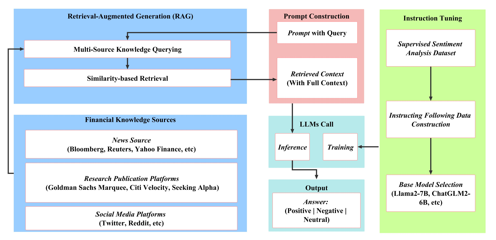

# AI-Powered Consulting Analyst

## Overview

This repository contains the implementation of a retrieval-augmented Large Language Models (LLMs) framework specifically designed for financial sentiment analysis. Traditional approaches often struggle with the concise nature of financial news, making accurate sentiment analysis challenging. Our method addresses these challenges by integrating an instruction-tuned LLM module with a retrieval-augmentation mechanism.

## Abstract

Financial sentiment analysis plays a pivotal role in valuation and investment decision-making. Traditional NLP models, constrained by their parameter size and training data scope, frequently underperform in this domain. While Large Language Models (LLMs) have shown remarkable results across various NLP tasks, their direct application to financial sentiment analysis presents unique challenges. Our proposed framework mitigates these issues, achieving a performance improvement of 15% to 48% in accuracy and F1 score compared to traditional models and other LLMs.

## Key Contributions

1. **Development of a novel retrieval-augmented LLM framework** specifically tailored for financial sentiment analysis, enabling more nuanced and accurate predictions.
2. **Implementation of instruction tuning**, enhancing the model's ability to respond effectively to user-specific financial sentiment analysis tasks.
3. **Extensive evaluations demonstrate** that our approach significantly outperforms traditional sentiment analysis models and leading general-purpose LLMs.

## License

This project is licensed under the MIT License. See the `LICENSE` file for more details.
